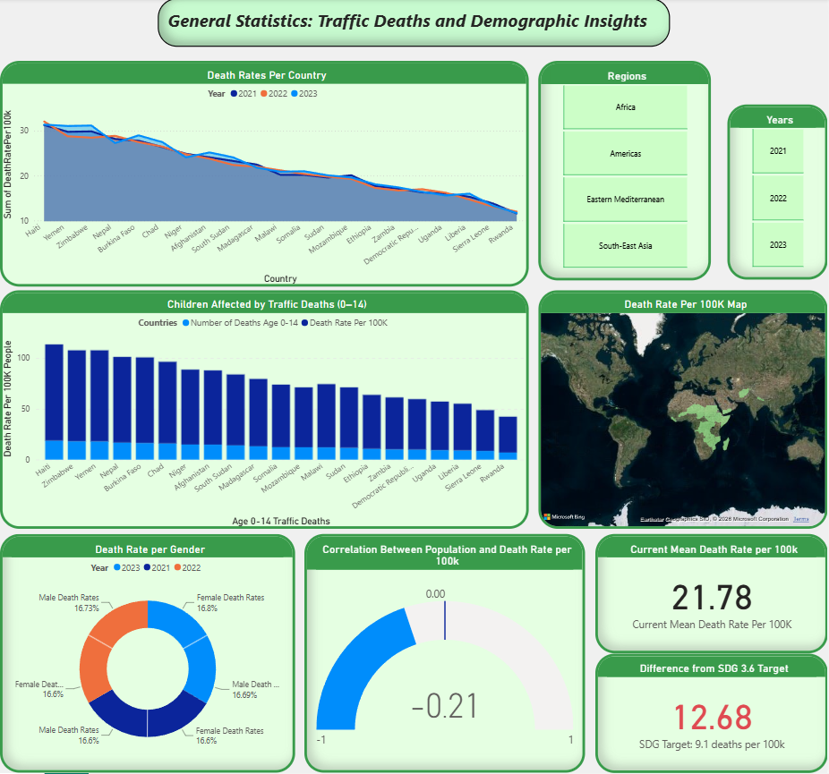
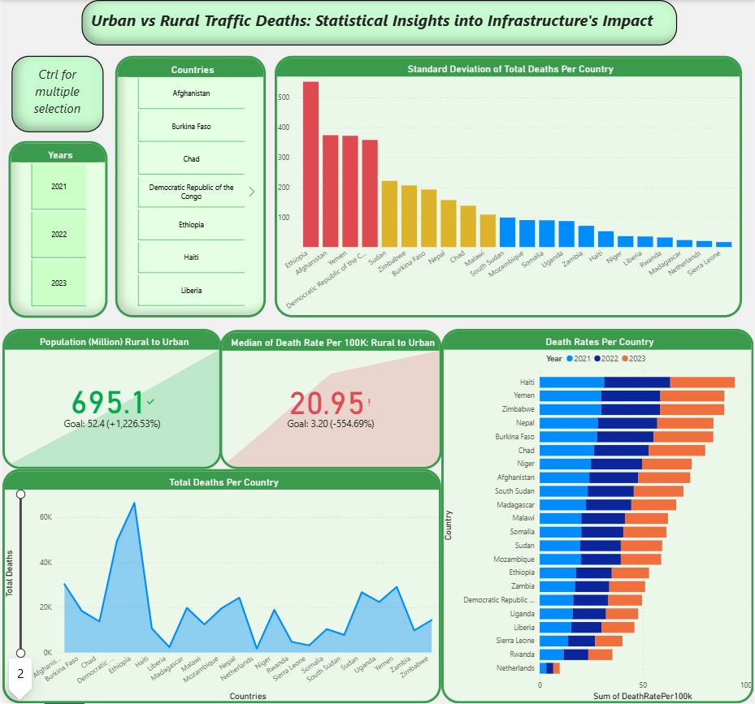

# Road Traffic Deaths Dashboard (SDG 3.6)

This interactive Power BI dashboard tracks progress on UN Sustainable Development Goal target 3.6: halving road traffic deaths. It compares death rates across countries, demographic groups, and rural versus urban settings, and measures how far the current mean death rate is from the target.

It was an individual university project at Breda University of Applied Sciences (Applied Data Science & AI, Year 1), from September to October 2024. The client was the university's SDG Hub, and the dashboard was improved in a later revision.

*Overview page: death rates per country and year, child deaths, deaths by gender, the population–death rate correlation and the gap to the 9.1 target.*

*Urban vs rural page: variation in total deaths per country, and the rural countries' population and median death rate compared with the Netherlands.*

## The problem

Road traffic injuries are one of the leading causes of preventable death. They hit children, pedestrians and cyclists in low-income countries hardest. The research question:

> How do road traffic death rates vary across demographics, regions, and urban versus rural settings? How does the current mean death rate compare with the SDG 3.6 target of 9.1 deaths per 100,000 population?

## How it works

1. **Data.** The dashboard uses two sources:
   - **WHO country estimates** of road traffic deaths and death rates per 100,000 (Global Status Report on Road Safety 2023), including breakdowns by sex and age.
   - **Statistics Netherlands (CBS)** road deaths, used as an urban comparison case.
2. **Preparation.**
   - **Excel:** duplicates removed, columns standardised, and the data filtered to low-income countries plus the Netherlands.
   - **Python:** total deaths derived as rate × population ÷ 100,000, plus columns per age group and per year (2021–2023).
   - **Power Query:** columns with many missing values removed.
3. **Calculations.** The dashboard computes:
   - the mean and median death rates
   - the gap to the 9.1 target
   - the standard deviation of total deaths
   - the correlation between population and death rate, from covariance and standard deviations, cross-checked in Python
4. **Dashboard.** Two pages with year, region and country slicers:
   - **General statistics:**
     - a world map of death rates
     - deaths by gender
     - child deaths (ages 0–14) by country
     - death rates per country over time
     - KPI cards for the current mean death rate and its distance from the SDG target
     - a gauge for the population–death rate correlation
   - **Urban vs rural:**
     - death rates and total deaths per country
     - KPIs comparing the median death rate and population of rural countries with the Netherlands
     - the standard deviation of total deaths per country

The full CRISP-DM write-up is in [docs/crisp-dm-report.md](docs/crisp-dm-report.md).

## Results

With no filters applied, the dashboard covers 21 countries from 2021 to 2023.

- **Target:** the mean death rate is **21.78 per 100,000 people**, 12.68 above the dashboard's target of 9.1.
- **Regions:** low-income regions, Africa in particular, have the highest death rates.
- **Population:** population size and death rate have a weak negative correlation (**−0.21**), so larger countries don't have higher rates. Several countries with far smaller populations than the Netherlands have much higher median death rates. This points to infrastructure and socio-economic factors rather than population size.

**Limitations**

- The data covers only three years (2021–2023).
- Some country and group figures are missing.
- The analysis is descriptive: no infrastructure or enforcement variables, and no forecasting.

## My role

This was an individual project: the research question, data sourcing and cleaning, the measures, the dashboard design and the report are all mine.

## Tech stack

Power BI (Power Query, DAX), Excel, Python, CRISP-DM.

## Data

The Power BI file and the datasets are not included in this repository. To rebuild the dashboard, download the public data from the sources below:

- [WHO Global Status Report on Road Safety 2023](https://www.who.int/teams/social-determinants-of-health/safety-and-mobility/global-status-report-on-road-safety-2023): estimated road traffic death rates and deaths per country.
- [Statistics Netherlands (CBS)](https://www.cbs.nl/en-gb/news/2024/15/684-road-traffic-deaths-in-2023): road traffic deaths in the Netherlands.
